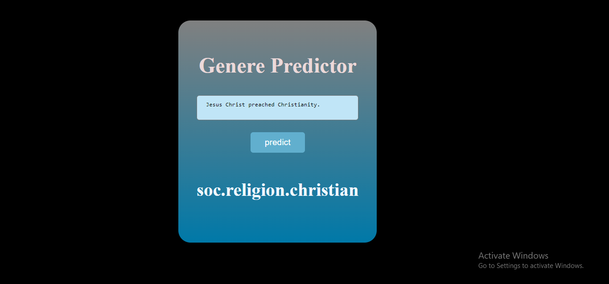

# Genre Predictor

## Overview
This project is a machine learning-based system designed to predict the genre of an article. The application utilizes a Multinomial Naive Bayes Classifier for genre prediction, with a Flask framework serving as the backend and HTML/CSS for the frontend. The dataset used for training the model is sourced from the `fetch_20newsgroups` module in the `sklearn.datasets` library.

## Screenshots

## Technologies Used
- **Frontend:** HTML, CSS
- **Backend:** Python Flask framework
- **Machine Learning:** Multinomial Naive Bayes Classifier
- **Dataset:** `fetch_20newsgroups` from `sklearn.datasets` library
- **ML to Backend Connection:** Pickle

## Project Structure
- `templates/`: Contains HTML files.
- `static/`: Contains CSS files for the html files under static folder.
- `model.pkl`: Includes the trained Multinomial Naive Bayes Classifier.
- `app.py`: Implements the Flask backend to handle requests from frontend, interact with the machine learning model, and serve the predictions.

## Usage
1. Clone the repository to your local machine.
   ```bash
   git clone https://github.com/Draksha-the-decoder/genere-predictor.git
   cd genere-predictor
2. Run the Flask application to start the backend server.
   ```bash
   python app.py
3. Open your web browser and navigate to http://localhost:5000 to access the application.
4. To retrain the model or experiment with different datasets, make changes in ml.py

## Future Improvements
- Incorporate more advanced machine learning models for better genre prediction accuracy.
- Enhance the frontend for a more user-friendly experience.
- Optimize and modularize the codebase for scalability.

## Contribution
Contributions are welcome! Feel free to open issues and pull requests.
